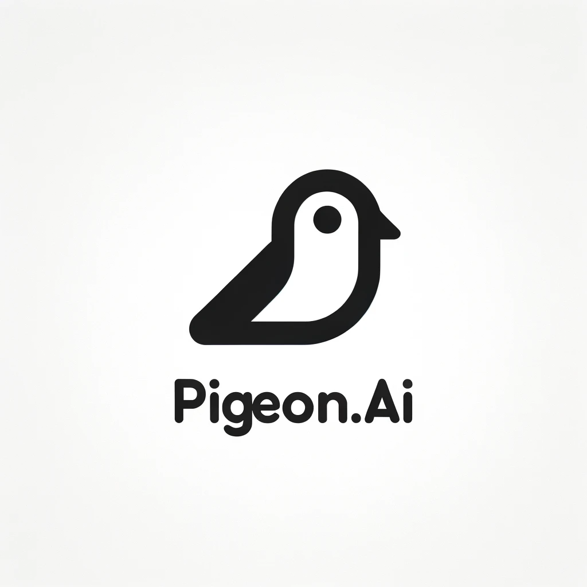

<a name="readme-top"></a>

[![Contributors][contributors-shield]][contributors-url]
[![Forks][forks-shield]][forks-url]
[![Stargazers][stars-shield]][stars-url]
[![Issues][issues-shield]][issues-url]
[![GPL-3.0 License][license-shield]][license-url]


<br />
<div align="center">
  <a href="https://github.com/pigeonai-org/ViDove">
    
  </a>

  <h3 align="center">ViDove: A Translation Agent System with Multimodal Context and Memory-Augmented Reasoning</h3>

  <p align="center">
    Transcribe and Translate Your Video with a Single Click
    <br />
    <a href="https://pigeonai.club/"><strong>Offical Website »</strong></a>
    <br />
    <br />
    <a href="https://arxiv.org/abs/2507.07306">📃 Paper</a>
    <!-- ·
    <a href="https://pigeonai.club/">🌐 Demo</a> -->
    ·
    <a href="https://github.com/pigeonai-org/ViDove/issues">🐛 Report Bug</a>
    ·
    <a href="https://github.com/pigeonai-org/ViDove/issues">💡 Request Feature</a>
  </p>
</div>


<!-- TABLE OF CONTENTS -->
<details>
  <summary>Table of Contents</summary>
  <ol>
    <li><a href="#release">Release</a></li>
    <li>
      <a href="#about-the-project">About The Project</a>
    </li>
    <li>
      <a href="#getting-started">Getting Started</a>
      <ul>
        <li><a href="#installation">Installation</a></li>
      </ul>
    </li>
    <li><a href="#usage">Usage</a></li>
    <li><a href="#dovebench">DoveBench</a></li>
    <li><a href="#experiments">Experiments</a></li>
    <li><a href="#citation">Citation</a></li>
    <li><a href="#contributing">Contributing</a></li>
    <li><a href="#license">License</a></li>
    <li><a href="#contact">Contact</a></li>
  </ol>
</details>

## News
- [10/09/25] Our paper has been accepted by [EMNLP 2025 Demo](https://aclanthology.org/2025.emnlp-demos.17/)!
- [09/07/25] 🔥**ViDove V1.0.0:** We are happy to release ViDove V1.0.0 and our paper on arXiv： [ViDove: A Translation Agent System with Multimodal Context and Memory-Augmented Reasoning](https://arxiv.org/abs/2507.07306)
- [03/03/24]  We are happy to tell you that you could try to use RAG-boosted translation by selecting specific domain assistant in the UI under the translation section.
- [12/20]🔥**ViDove V0.1 Released**: We are happy to release our initial version of ViDove: End-to-end Video Translation Toolkit. 
<p align="right">(<a href="#readme-top">back to top</a>)</p>

## Join Us
**We are looking for talented people to join our team. If you are interested in our project, please send your resume to gggzmz@163.com.**


<!-- ABOUT THE PROJECT -->
## About The Project

<!-- [![Product Name Screen Shot][product-screenshot]](https://example.com) -->

Introducing **ViDove**, a translation agent system that brings multimodal context and memory-augmented reasoning into an end-to-end video subtitling workflow. Inspired by professional translators, ViDove coordinates specialized agents (Vision, Auditory, Translation, Proofreader, Editor) over a unified memory to leverage visual/audio cues, domain knowledge, and retrieval-augmented context for accurate, consistent, and scalable translations. The system is open-source, modular, privacy-friendly, and configurable without model fine-tuning.

Here's why:
* **Multimodal, agentic pipeline** (media/link → subtitles/video):
  - Ingest YouTube links or local video/audio, extract frames and speech cues, then collaborate across agents to produce bilingual SRT and rendered video.
  - Modular stages: ASR/SpeechLM → pre_process → LLM translation → post_process → output render.
* **Memory-augmented reasoning**:
  - Short-term memory maintains intra-video context (translation history, visual/audio cues) for terminology and style consistency.
  - Long-term memory integrates domain knowledge and optional web knowledge for better factuality and adaptation.
* **Retrieval and domain adaptation**:
  - Domain assistants with RAG and custom dictionaries help preserve terms and tone in specialized fields (e.g., StarCraft II).
* **Quality and consistency**:
  - Demonstrates higher BLEU/BLEURT and lower SubER versus strong baselines on DoveBench; see Experiments for tables.
* **Open and extensible**:
  - Streamlit UI for quick start; YAML configs in `configs/*.yaml`; plug in ASR models (e.g., Whisper), LLM providers, and tools to fit your environment.

**📖 For detailed implementation documentation**, including architecture overview, pipeline stages, and module descriptions, see [Implementation Documentation](doc/IMPLEMENTATION.md). For better readability, please install mermaid plugin in your markdown editor.

<p align="right">(<a href="#readme-top">back to top</a>)</p>

## Main Contributors
<a href="https://github.com/pigeonai-org/ViDove/graphs/contributors">
  
</a>


<!-- GETTING STARTED -->
## Getting Started

**We recommend you use UNIX like operating systems(MacOS/Linux Family) for local installation.**

### Quick Start with Docker (Recommended)

The easiest way to run ViDove is using Docker to host our web-demos:

```sh
# 1. Clone the repository
git clone https://github.com/pigeonai-org/ViDove.git
cd ViDove

# 2. Set up environment variables
cp .env.example .env
# Edit .env and add your API keys

# 3. Start the services
./docker-manage.sh start

# 4. Access the web interface
# Frontend: http://localhost:3000
# Backend API: http://localhost:8000/docs
```

For detailed Docker deployment guide, see the [Docker Deployment Doc](doc/DOCKER_DEPLOYMENT.md).

### Installation (Local Development)

1. Get a OpenAI API Key at [https://platform.openai.com/api-keys](https://platform.openai.com/api-keys)
2. Clone the repo
   ```sh
   git clone https://github.com/pigeonai-org/ViDove.git
   cd ViDove
   ```
3. Install Requirements. We use `uv` for fast, reliable package management.
   ```sh
   # Install uv package manager
   curl -LsSf https://astral.sh/uv/install.sh | sh
   
   # Install core dependencies (optimized for API-based workflow)
   uv sync
   
   # Activate virtual environment
   source .venv/bin/activate  # Unix/macOS
   # or: .venv\Scripts\activate  # Windows
   ```
   
   **Optional Features** (install only what you need):
   ```sh
   # For local Whisper models (instead of OpenAI API)
   uv sync --extra audio-local
   
   # For local speaker diarization (instead of Pyannote API)
   uv sync --extra audio-advanced
   
   # For CLIP vision features
   uv sync --extra vision
   
   # For Streamlit/Gradio UI
   uv sync --extra ui
   
   # For evaluation tools
   uv sync --extra evaluation
   
   # Install everything
   uv sync --extra all
   ```
   
   **Note**: Core dependencies are optimized for API-based workflows (OpenAI Whisper API, Pyannote API, GPT-4 Vision). Local model alternatives are available as optional extras.
4. Enter your API in bash
   
   UNIX Like:

   ```sh
   export OPENAI_API_KEY="your_api_key" 
   ```

   Windows:
   ```sh
   set OPENAI_API_KEY="your_api_key" 
   ```
5. Install FFmpeg:

   Download FFmpeg [here](https://ffmpeg.org/)

   For more specfic guide on FFmpeg installation on different platforms: [Click Here](doc/ffmpeg_guide_en.md) | [点击此处](doc/ffmpeg_guide_zh.md)

   ~~We recommand you use [Chocolatey Package Manager](https://chocolatey.org/) to install ffmpeg~~


<p align="right">(<a href="#readme-top">back to top</a>)</p>


<!-- USAGE EXAMPLES -->
## Usage

### Launch with configs
  - Start with Youtube Link input:
    ```sh
    python3 entries/run.py --link "your_youtube_link"
    ```
  - Start with Video input:
    ```sh
    python3 entries/run.py --video_file path/to/video_file
    ```
  - Start with Audio input:
    ```sh
    python3 entries/run.py --audio_file path/to/audio_file
    ```
  - Start with SRT input:
    ```sh
    python3 entries/run.py --srt_file path/to/subtitles.srt
    ```
  - Assistant mode (disables spell check and term correction automatically):
    ```sh
    python3 entries/run.py --link "your_youtube_link" --is_assistant True
    ```
  - Terminal Usage:
    ```sh
    usage: run.py [-h] [--link LINK] [--video_file VIDEO_FILE] [--audio_file AUDIO_FILE] [--srt_file SRT_FILE] [--is_assistant IS_ASSISTANT] [--launch_cfg LAUNCH_CFG] [--task_cfg TASK_CFG]

    options:
      -h, --help            show this help message and exit
      --link LINK           youtube video link here
      --video_file VIDEO_FILE
                            local video path here
      --audio_file AUDIO_FILE
                            local audio path here
      --srt_file SRT_FILE   srt file input path here
      --is_assistant IS_ASSISTANT
                            is assistant mode (True/False)
      --launch_cfg LAUNCH_CFG
                            launch config path
      --task_cfg TASK_CFG   task config path
    ```

  Tips: API source and keys
  - Edit `configs/local_launch.yaml` to switch API provider and mode:
    - `api_source: openai | azure`
    - `environ: local | demo`
  - If `api_source: openai`, set your key before running:
    - UNIX: `export OPENAI_API_KEY="your_api_key"`
    - Windows: `set OPENAI_API_KEY="your_api_key"`
  - If `api_source: azure`, set your key before running:
    - UNIX: `export AZURE_OPENAI_API_KEY="your_api_key"`
    - Windows: `set AZURE_OPENAI_API_KEY="your_api_key"`
  - Streamlit UI (`entries/app.py`) can accept keys via the interface in `demo` mode; in `local` mode it reads env vars according to `api_source`.

### Quick Start with Streamlit User Interface
  ```sh
  streamlit run entries/app.py 
  ```

### Configs
  Use "--launch_cfg" and "--task_cfg" in run.py to change launch or task configuration
  - configs/local_launch.yaml 
    ```yaml
    # launch config for local environment
    local_dump: ./local_dump # change local dump dir here
    environ: local # demo or local
    api_source: openai # openai or azure
    ```
  - configs/task_config.yaml
    
    copy and change this config for different configuration
    ```yaml
    # configuration for each task
    source_lang: EN
    target_lang: ZH
    domain: General

    # Global parallelism control
    num_workers: 8

    # Customize User Instruction
    instructions:
      - "Keep the translation natural and fluent"
      - "Use appropriate terminology for the domain"
      - "Maintain the original tone and style"

    # YouTube Download Option
    video_download:
      resolution: 480 # 360, 480, 720, best(best we can find)

    MEMEORY:
      enable_local_knowledge: False
      enable_vision_knowledge: True
      enable_web_search: False
      local_knowledge_path: ./domain_dict

    audio:
      enable_audio: True
      audio_agent: WhisperAudioAgent # GeminiAudioAgent | WhisperAudioAgent | QwenAudioAgent | GPT4oAudioAgent
      model_path:  # replace it with your own model path
      VAD_model: API # pyannote/speaker-diarization-3.1
      src_lang: en
      tgt_lang: zh

    vision:
      enable_vision: True
      vision_model: gpt-4o-mini # CLIP | gpt-4o | gpt-4o-mini
      model_path: ./ViDove/vision_model/clip-vit-base-patch16 # replace it with your own model path
      frame_cache_dir: ./cache # should be cleared after task finished
      frame_per_seg: 4 # number of frames extracted from segment
      
    # pre-process module config
    pre_process: 
      sentence_form: True
      spell_check: False
      term_correct: True

    # Translation module config
    translation:
      model: gpt-4o # gpt-4 | gpt-4o-mini | gpt-4o | Assistant | Multiagent | RAG | gpt-5 | gpt-5-mini
      chunk_size: 2000
      use_history: True     # include recent translation history per request
      max_retries: 1        # retries per chunk for transient API errors

    # post-process module config
    post_process:
      enable_post_process: True
      check_len_and_split: True
      remove_trans_punctuation: True

    proofreader: 
      enable_proofreading: True
      window_size: 5 # number of sentences per proofreading chunk
      short_term_memory_len: 5 # maximum number of sentences stored in short term memory
      enable_short_term_memory: False # whether to use short term memory for proofreading
      verbose: True # whether to print the proofreading process

    editor:
      enable_editor: True
      editor_context_window: 10 # number of sentences to be provided as context for the editor(previous and next {n} sentences)
      history_length: 5 # number of sentences to be provided as history for the editor(previous {n} sentences)
      user_instruction: none # none | formal | casual | technical

    # output type that user receive
    output_type: 
      subtitle: srt
      video: False
      bilingual: True
    ```

## DoveBench

DoveBench is an open benchmark for long-form video automatic subtitling introduced with ViDove. It focuses on end-to-end media-to-subtitle evaluation under realistic conditions.

- Scale: ~17 hours of videos; average length ~20 minutes per video
- Annotations: Professional Chinese (ZH) subtitles aligned to timestamps
- Use cases: Evaluates consistency, terminology fidelity, and readability in long-form scenarios
- Metrics: BLEU, BLEURT, SubER, SubSONAR, sCOMET (see Experiments)
- Categories: Includes specialized domains (e.g., StarCraft II) for domain adaptation analysis

Planned release: The SRT data and related resources will be released in this repository in the future. Stay tuned.

<p align="right">(<a href="#readme-top">back to top</a>)</p>

## Experiments

We summarize core findings from our paper on retrieval-augmented, multimodal, and memory-enhanced translation:

- Strong end-to-end performance across media-to-subtitle workflows, improving translation quality and consistency compared to non-contextual baselines.
- Retrieval-augmented domain assistants reduce terminology errors and improve style adherence in specialized domains.
- Incorporating multimodal visual cues helps disambiguate entities and improves subtitle readability on challenging clips.
- Memory-augmented reasoning maintains cross-segment consistency for names, terms, and speaker styles over longer videos.

For full benchmarks, datasets, and ablation details, please see the paper: [ViDove: A Translation Agent System with Multimodal Context and Memory-Augmented Reasoning](https://arxiv.org/abs/2507.07306).

<p align="right">(<a href="#readme-top">back to top</a>)</p>

### Main Results

ViDove compared with baseline systems on DoveBench and BigVideo:

| Model              | DoveBench BLEU (↑) | BLEURT (↑) | SubER (↓) | SubSONAR (↑) | BigVideo BLEU (↑) | sCOMET (↑) |
|--------------------|--------------------:|-----------:|----------:|-------------:|------------------:|-----------:|
| Gemini-2.5-Flash   |               8.11  |      17.21 |    103.46 |         0.31 |             26.43 |      **0.75** |
| Qwen-2.5-Omni      |              14.60  |      13.83 |    108.94 |         0.39 |             10.67 |       0.58 |
| VideoCaptioner     |              12.65  |      14.62 |     85.75 |      **0.41** |         **30.36** |      **0.75** |
| Whisper + DelTA    |              18.26  |      12.30 |     86.83 |         0.28 |             29.09 |       0.69 |
| ViDove             |            **23.51** |   **19.55** | **73.38** |         0.39 |             26.05 |       0.73 |

- On DoveBench, ViDove achieves the best BLEU (23.51), BLEURT (19.55), and lowest SubER (73.38).
- Compared to the strongest baseline (Whisper + DelTA), ViDove is +28.8% BLEU, +58.9% BLEURT, and −15.5% SubER.
- On BigVideo, VideoCaptioner leads BLEU (30.36) and ties sCOMET (0.75) with Gemini-2.5-Flash; ViDove is competitive (BLEU 26.05, sCOMET 0.73).

### Ablation Study (DoveBench subset)

| Model Variant                    | BLEU (↑) | SubER (↓) | BLEURT (↑) |
|----------------------------------|---------:|----------:|-----------:|
| ViDove (full)                    |    15.84 |     76.26 |      17.11 |
| w/o domain memory                |    14.86 |     77.31 |      17.84 |
| w/o domain memory & vision       |    14.56 |     77.55 |      17.50 |
| w/o Proofreader                  |    13.56 |     80.76 |      16.93 |

Observations:
- Domain memory improves BLEU and reduces SubER; removing it degrades consistency.
- Proofreader removal causes the largest quality drop, showing its importance for corrections and consistency.
- Vision has limited effect on BLEU/BLEURT averages but helps entity-level correctness for names/objects.

<p align="right">(<a href="#readme-top">back to top</a>)</p>

## Citation

If you find ViDove useful for your research or applications, please cite our paper:

```bibtex
@misc{lu2025vidovetranslationagentmultimodal,
      title={ViDove: A Translation Agent System with Multimodal Context and Memory-Augmented Reasoning}, 
      author={Yichen Lu and Wei Dai and Jiaen Liu and Ching Wing Kwok and Zongheng Wu and Xudong Xiao and Ao Sun and Sheng Fu and Jianyuan Zhan and Yian Wang and Takatomo Saito and Sicheng Lai},
      year={2025},
      eprint={2507.07306},
      archivePrefix={arXiv},
      primaryClass={cs.AI},
      url={https://arxiv.org/abs/2507.07306}, 
}
```

<p align="right">(<a href="#readme-top">back to top</a>)</p>


<!-- ROADMAP -->
<!-- ## Roadmap

- [x] Add Changelog
- [x] Add back to top links
- [ ] Add Additional Templates w/ Examples
- [ ] Add "components" document to easily copy & paste sections of the readme
- [ ] Multi-language Support
    - [ ] Chinese
    - [ ] Spanish

See the [open issues](https://github.com/pigeonai-org/ViDove/issues) for a full list of proposed features (and known issues).

<p align="right">(<a href="#readme-top">back to top</a>)</p>
 -->


<!-- CONTRIBUTING -->
## Contributing

Contributions are what make the open source community such an amazing place to learn, inspire, and create. Any contributions you make are **greatly appreciated**.

If you have a suggestion that would make this better, please fork the repo and create a pull request. You can also simply open an issue with the tag "enhancement".
Don't forget to give the project a star! Thanks again!

1. Fork the Project
2. Create your Feature Branch (`git checkout -b feature/AmazingFeature`)
3. Commit your Changes (`git commit -m 'Add some AmazingFeature'`)
4. Push to the Branch (`git push origin feature/AmazingFeature`)
5. Open a Pull Request

<p align="right">(<a href="#readme-top">back to top</a>)</p>


<!-- LICENSE -->
## License

Distributed under the  GPL-3.0 license. See `LICENSE` for more information.

<p align="right">(<a href="#readme-top">back to top</a>)</p>


<!-- CONTACT -->
## Contact

Developed by **Pigeon.AI**🐦 from Star Pigeon Fan-sub Group.

See Our [Bilibili Account](https://space.bilibili.com/195670539)

Official Email: gggzmz@163.com

<p align="right">(<a href="#readme-top">back to top</a>)</p>


<!-- ACKNOWLEDGMENTS -->
<!-- ## Acknowledgments

Use this space to list resources you find helpful and would like to give credit to. I've included a few of my favorites to kick things off!

* [Choose an Open Source License](https://choosealicense.com)
* [GitHub Emoji Cheat Sheet](https://www.webpagefx.com/tools/emoji-cheat-sheet)
* [Malven's Flexbox Cheatsheet](https://flexbox.malven.co/)
* [Malven's Grid Cheatsheet](https://grid.malven.co/)
* [Img Shields](https://shields.io)
* [GitHub Pages](https://pages.github.com)
* [Font Awesome](https://fontawesome.com)
* [React Icons](https://react-icons.github.io/react-icons/search)
* 

<p align="right">(<a href="#readme-top">back to top</a>)</p> -->


<!-- MARKDOWN LINKS & IMAGES -->
<!-- https://www.markdownguide.org/basic-syntax/#reference-style-links -->
[contributors-shield]: https://img.shields.io/github/contributors/pigeonai-org/ViDove.svg?style=for-the-badge
[contributors-url]: https://github.com/pigeonai-org/ViDove/graphs/contributors
[forks-shield]: https://img.shields.io/github/forks/pigeonai-org/ViDove.svg?style=for-the-badge
[forks-url]: https://github.com/pigeonai-org/ViDove/forks
[stars-shield]: https://img.shields.io/github/stars/pigeonai-org/ViDove.svg?style=for-the-badge
[stars-url]: https://github.com/pigeonai-org/ViDove/stargazers
[issues-shield]: https://img.shields.io/github/issues/pigeonai-org/ViDove.svg?style=for-the-badge
[issues-url]: https://github.com/pigeonai-org/ViDove/issues
[license-shield]: https://img.shields.io/github/license/pigeonai-org/ViDove.svg?style=for-the-badge
[license-url]: https://github.com/pigeonai-org/ViDove/blob/main/LICENSE


