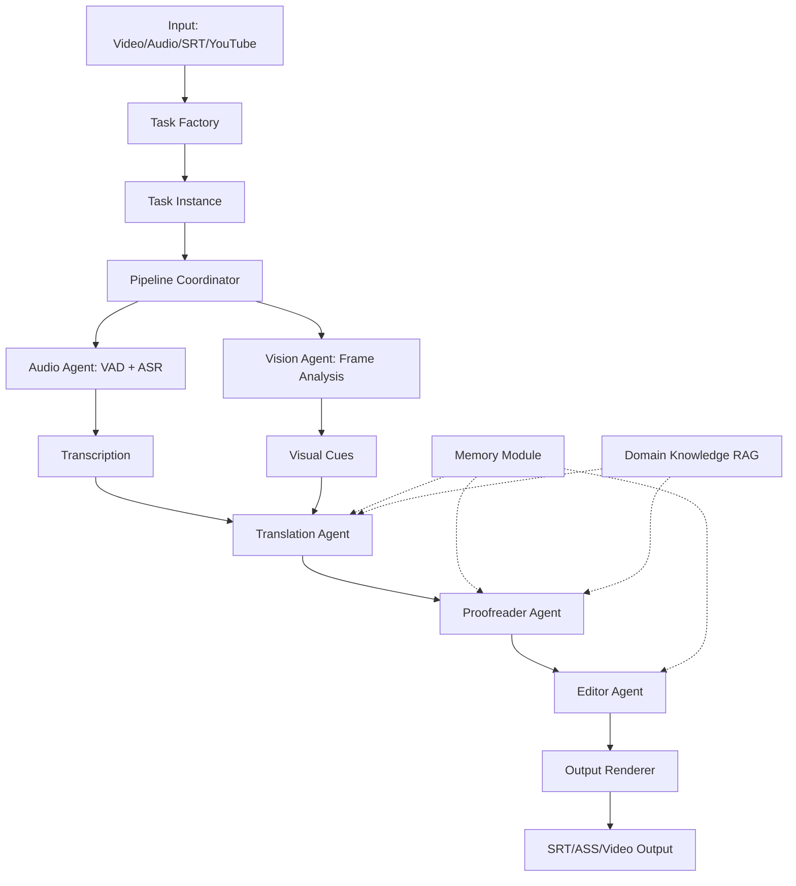
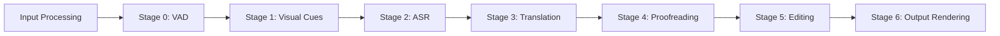
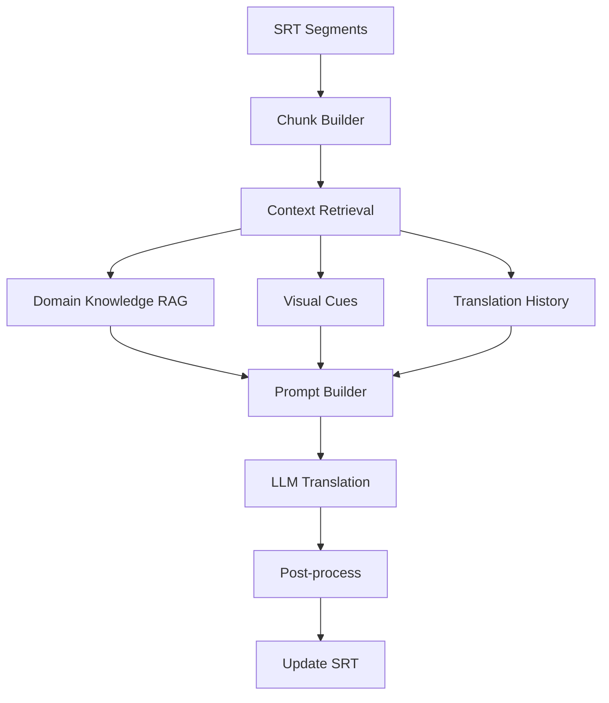

# ViDove Implementation Documentation

## Table of Contents

1. [Overview](#overview)
2. [Architecture](#architecture)
3. [Entry Points](#entry-points)
4. [Pipeline Stages](#pipeline-stages)
5. [Core Modules](#core-modules)
6. [Task Types](#task-types)
7. [Configuration](#configuration)

---

## Overview

ViDove is an end-to-end video translation system that leverages multi-agent architecture with multimodal context and memory-augmented reasoning. The system transforms video/audio content into translated subtitles through a sophisticated pipeline involving ASR (Automatic Speech Recognition), vision analysis, translation, proofreading, and editing.

**Key Features:**
- Multi-agent architecture with specialized agents (Vision, Audio, Translation, Proofreader, Editor)
- Memory-augmented reasoning with short-term and long-term memory
- Domain-specific knowledge retrieval (RAG)
- Support for multiple input types (YouTube links, video files, audio files, SRT files)
- Configurable pipeline with pre/post-processing stages
- Multimodal context integration (visual cues + audio transcription)

---

## Architecture

ViDove follows a modular, agent-based architecture where each component handles a specific aspect of the translation pipeline.



### High-Level Components

| Component | Location | Purpose |
|-----------|----------|---------|
| **Task Orchestrator** | [`src/task.py`](file:///Users/jiaenliu/Documents/Codes/ViDove/src/task.py) | Main pipeline coordinator and task lifecycle management |
| **Audio Processing** | [`src/audio/`](file:///Users/jiaenliu/Documents/Codes/ViDove/src/audio) | VAD, ASR, and audio agent implementations |
| **Vision Processing** | [`src/vision/`](file:///Users/jiaenliu/Documents/Codes/ViDove/src/vision) | Visual cue extraction and frame analysis |
| **Translation** | [`src/translators/`](file:///Users/jiaenliu/Documents/Codes/ViDove/src/translators) | LLM-based translation with context |
| **Editorial** | [`src/editorial/`](file:///Users/jiaenliu/Documents/Codes/ViDove/src/editorial) | Proofreading and editing agents |
| **Memory** | [`src/memory/`](file:///Users/jiaenliu/Documents/Codes/ViDove/src/memory) | RAG and knowledge retrieval |
| **SRT Processing** | [`src/SRT/`](file:///Users/jiaenliu/Documents/Codes/ViDove/src/SRT) | Subtitle parsing, formatting, and processing |

---

## Entry Points

ViDove provides multiple entry points for different use cases:

### 1. Command Line Interface (CLI)

**File:** [`entries/run.py`](file:///Users/jiaenliu/Documents/Codes/ViDove/entries/run.py)

The primary entry point for terminal/script usage. Supports:

```bash
# YouTube link
python3 entries/run.py --link "https://youtube.com/watch?v=..."

# Video file
python3 entries/run.py --video_file path/to/video.mp4

# Audio file
python3 entries/run.py --audio_file path/to/audio.wav

# SRT file (translation only)
python3 entries/run.py --srt_file path/to/subtitles.srt

# With custom configs
python3 entries/run.py --link "..." --launch_cfg ./configs/custom_launch.yaml --task_cfg ./configs/custom_task.yaml
```

**Key Responsibilities:**
- Parse command-line arguments
- Load and validate configuration files
- Initialize task directory structure
- Create appropriate Task instance based on input type
- Execute the pipeline

### 2. Streamlit Web Interface

**File:** [`entries/app.py`](file:///Users/jiaenliu/Documents/Codes/ViDove/entries/app.py)

A user-friendly web interface for non-technical users.

```bash
streamlit run entries/app.py
```

**Features:**
- Input selection (YouTube link, video upload, audio upload, SRT upload)
- Configuration UI for:
  - Language selection (source/target)
  - Domain dictionary selection
  - ASR method selection
  - Pre/post-processing options
  - Translation model selection
  - Output format options
- API key management (demo mode with encryption or local mode with env vars)
- Download results (SRT files and logs)

**Key Functions:**
- `init()`: Initializes task configuration from UI inputs
- `process_input()`: Routes input to appropriate Task factory method
- `main()`: Streamlit UI definition

---

## Pipeline Stages

The core pipeline is defined in [`src/task.py`](file:///Users/jiaenliu/Documents/Codes/ViDove/src/task.py) through the `run_pipeline()` method. Here's a detailed breakdown of each stage:

### Pipeline Overview



### Stage 0: Voice Activity Detection (VAD)

**Method:** `get_speaker_segments()`  
**Lines:** [294-301](file:///Users/jiaenliu/Documents/Codes/ViDove/src/task.py#L294-L301)

**Purpose:** Segment audio into speaker-based chunks for efficient ASR processing.

**Process:**
1. Audio agent analyzes the audio file
2. Detects speaker boundaries and silence
3. Creates audio segments with timestamps
4. If video is present, clips corresponding video segments
5. Stores segments in SRT script structure

**Output:** `self.SRT_Script` with segment boundaries

**Configuration:**
- `audio.audio_agent`: Agent selection (WhisperAudioAgent, GeminiAudioAgent, GPT4oAudioAgent)
- `audio.VAD_model`: VAD model selection (API or local model)

---

### Stage 1: Visual Cue Extraction

**Method:** `get_visual_cues()`  
**Lines:** [303-366](file:///Users/jiaenliu/Documents/Codes/ViDove/src/task.py#L303-L366)

**Purpose:** Extract visual context from video frames to aid translation.

**Process:**
1. For each video segment:
   - Extract frames at configured rate (`frame_per_seg`)
   - Analyze frames using vision agent (CLIP or GPT-4o)
   - Generate visual descriptions
2. Parallel processing controlled by `num_workers` (Unsupported with local models)
3. Store visual cues in corresponding SRT segments
4. Optionally index into vision knowledge base for retrieval

**Output:** Visual cues attached to each segment + vision knowledge index

**Configuration:**
- `vision.enable_vision`: Toggle vision processing
- `vision.vision_model`: Model selection (CLIP, gpt-4o, gpt-4o-mini)
- `vision.frame_per_seg`: Number of frames to analyze per segment
- `num_workers`: Parallel processing workers

**Example Visual Cue:**
```
"A person pointing at a computer screen showing code. 
 Two characters visible on screen, one with blue armor."
```

---

### Stage 2: Automatic Speech Recognition (ASR)

**Method:** `transcribe()`  
**Lines:** [369-447](file:///Users/jiaenliu/Documents/Codes/ViDove/src/task.py#L369-L447)

**Purpose:** Convert audio segments to text transcription.

**Process:**
1. Prepare batch of segment audio paths
2. Audio agent performs ASR on each segment
3. Parallel processing using `transcribe_batch()` if supported
4. Normalize timestamps relative to original timeline
5. Handle overlapping segments and edge cases
6. Convert to SRT segment format
7. Replace original segments with transcribed segments

**Output:** `self.SRT_Script` with transcribed text

**Configuration:**
- `audio.audio_agent`: Agent selection determines ASR method
- `audio.src_lang`: Source language for ASR
- `num_workers`: Controls parallel ASR processing

**Supported ASR Methods:**
- Whisper API (via OpenAI)
- Gemini Audio API
- GPT-4o Audio API
- Local Whisper models (stable-whisper)

---

### Stage 3: Translation

**Method:** `translation()`  
**Lines:** [488-510](file:///Users/jiaenliu/Documents/Codes/ViDove/src/task.py#L488-L510)

**Purpose:** Translate transcribed text to target language with context.

**Process:**
1. Set SRT script in translator
2. Choose translation mode:
   - **Sequential:** Process chunks one by one
   - **Parallel:** Process multiple chunks concurrently
3. For each chunk:
   - Retrieve relevant context from memory (domain knowledge, visual cues)
   - Include translation history for consistency
   - Call LLM with contextual prompt
   - Store translation in SRT segment
4. Handle retries for transient API errors

**Output:** `self.SRT_Script` with translated text

**Configuration:**
- `translation.model`: LLM selection (gpt-4o, gpt-4, gpt-4o-mini)
- `translation.chunk_size`: Characters per translation chunk
- `translation.use_history`: Include recent translations for context
- `translation.max_retries`: Retry count for API failures
- `num_workers`: Controls parallel translation (`>1` enables parallel)

**Context Integration:**
- **Visual cues:** Attached to segments
- **Domain knowledge:** Retrieved from RAG
- **Translation history:** Previous N translations
- **Special instructions:** User-defined preferences

---

### Stage 4: Proofreading

**Method:** `proofread()`  
**Lines:** [530-543](file:///Users/jiaenliu/Documents/Codes/ViDove/src/task.py#L530-L543)

**Purpose:** Review and correct translation errors, improve consistency.

**Process:**
1. Split SRT into overlapping windows (`window_size`)
2. For each window:
   - Review translation quality
   - Check terminology consistency
   - Verify context alignment
   - Suggest corrections
3. Apply corrections to SRT
4. Maintain short-term memory of recent edits

**Output:** Improved `self.SRT_Script`

**Configuration:**
- `proofreader.enable_proofreading`: Toggle proofreading
- `proofreader.window_size`: Sentences per proofreading batch
- `proofreader.short_term_memory_len`: Context window size
- `proofreader.enable_short_term_memory`: Use STM for consistency
- `num_workers`: Parallel proofreading

---

### Stage 5: Editing

**Method:** `editor()`  
**Lines:** [545-576](file:///Users/jiaenliu/Documents/Codes/ViDove/src/task.py#L545-L576)

**Purpose:** Apply user-specific styling and formatting preferences.

**Process:**
1. Collect user instructions from configuration
2. For each sentence:
   - Apply style adjustments (formal/casual/technical)
   - Enforce custom rules
   - Maintain context from previous sentences (`history_length`)
3. Apply edits to SRT

**Output:** Final polished `self.SRT_Script`

**Configuration:**
- `editor.enable_editor`: Toggle editing
- `editor.editor_context_window`: Context sentences
- `editor.history_length`: History for consistency
- `editor.user_instruction`: Custom style guide
- `instructions`: Global user instructions
- `num_workers`: Parallel editing

---

### Stage 6: Output Rendering

**Method:** `output_render()`  
**Lines:** [578-673](file:///Users/jiaenliu/Documents/Codes/ViDove/src/task.py#L578-L673)

**Purpose:** Generate final output files in requested formats.

**Process:**
1. **SRT Generation:**
   - Write pure target language SRT
   - Optionally write bilingual SRT (source + target)
2. **ASS Conversion:** Convert SRT to ASS if requested
3. **Video Rendering:** Burn subtitles into video using FFmpeg
   - Apply custom fonts and styling
   - Fallback to default fonts if custom fonts fail

**Output:**
- `{task_id}_{target_lang}.srt`: Pure translation
- `{task_id}_{source_lang}_{target_lang}.srt`: Bilingual (optional)
- `{task_id}.ass`: ASS format (optional)
- `{task_id}.mp4`: Video with burned subtitles (optional)

**Configuration:**
- `output_type.subtitle`: `srt` or `ass`
- `output_type.bilingual`: Enable bilingual output
- `output_type.video`: Enable video rendering

---

## Core Modules

### Audio Module (`src/audio/`)

**Files:**
- [`audio_agent.py`](file:///Users/jiaenliu/Documents/Codes/ViDove/src/audio/audio_agent.py): Audio agent implementations
- [`VAD.py`](file:///Users/jiaenliu/Documents/Codes/ViDove/src/audio/VAD.py): Voice activity detection
- [`ASR.py`](file:///Users/jiaenliu/Documents/Codes/ViDove/src/audio/ASR.py): Automatic speech recognition
- [`audio_prompt.py`](file:///Users/jiaenliu/Documents/Codes/ViDove/src/audio/audio_prompt.py): Prompts for audio agents

**Key Classes:**

#### WhisperAudioAgent
- Uses OpenAI Whisper API for ASR
- Delegates to VAD for segmentation
- Supports batch transcription

#### GeminiAudioAgent
- Uses Google Gemini multimodal API
- Integrated VAD and ASR
- Supports visual context in transcription

#### GPT4oAudioAgent
- Uses GPT-4o audio capabilities
- Integrated VAD and ASR
- Supports visual context

**Key Methods:**
- `segment_audio()`: VAD-based audio segmentation
- `transcribe()`: ASR on single segment
- `transcribe_batch()`: Parallel ASR on multiple segments
- `clip_video_and_save()`: Extract video segments aligned with audio

---

### Vision Module (`src/vision/`)

**Files:**
- [`vision_agent.py`](file:///Users/jiaenliu/Documents/Codes/ViDove/src/vision/vision_agent.py): Base vision agent interface
- [`gpt_vision_agent.py`](file:///Users/jiaenliu/Documents/Codes/ViDove/src/vision/gpt_vision_agent.py): GPT-4o and CLIP implementations

**Key Classes:**

#### GptVisionAgent
- Frame extraction and analysis
- Uses GPT-4o/GPT-4o-mini for visual understanding
- Generates natural language descriptions

#### CLIPVisionAgent
- Uses CLIP for vision-language embeddings
- Faster but less detailed than GPT-4o
- Good for entity recognition and scene classification

**Key Methods:**
- `analyze_video()`: Generate visual summary from video segment
- `extract_frames()`: Extract frames at configured intervals

---

### Translation Module (`src/translators/`)

**Files:**
- [`translator.py`](file:///Users/jiaenliu/Documents/Codes/ViDove/src/translators/translator.py): Main translation orchestrator
- [`LLM.py`](file:///Users/jiaenliu/Documents/Codes/ViDove/src/translators/LLM.py): LLM wrapper
- [`MTA.py`](file:///Users/jiaenliu/Documents/Codes/ViDove/src/translators/MTA.py): Multi-turn agent (Outdated, plan to remove)
- [`prompts.py`](file:///Users/jiaenliu/Documents/Codes/ViDove/src/translators/prompts.py): Translation prompts
- [`assistant.py`](file:///Users/jiaenliu/Documents/Codes/ViDove/src/translators/assistant.py): Domain assistant (Outdated, plan to remove)

**Key Features:**
- Context-aware translation with visual cues
- Memory-augmented reasoning with RAG
- Domain-specific terminology handling
- Translation history for consistency
- Parallel translation support

**Translation Flow:**


---

### Editorial Module (`src/editorial/`)

**Files:**
- [`proofreader.py`](file:///Users/jiaenliu/Documents/Codes/ViDove/src/editorial/proofreader.py): Proofreading agent
- [`editor.py`](file:///Users/jiaenliu/Documents/Codes/ViDove/src/editorial/editor.py): Editing agent

**Proofreader Responsibilities:**
- Terminology consistency checks
- Grammar and fluency improvements
- Context alignment verification
- Short-term memory for recent corrections

**Editor Responsibilities:**
- Style application (formal/casual/technical)
- User instruction enforcement
- Final polish and formatting

---

### Memory Module (`src/memory/`)

**Files:**
- [`basic_rag.py`](file:///Users/jiaenliu/Documents/Codes/ViDove/src/memory/basic_rag.py): Basic RAG implementation
- [`direct_search_RAG.py`](file:///Users/jiaenliu/Documents/Codes/ViDove/src/memory/direct_search_RAG.py): Web search RAG

**Key Features:**
- Domain-specific knowledge indexing
- Vector similarity search
- Web search integration (Tavily)
- Vision knowledge indexing

**Memory Types:**
1. **Local Knowledge:** Domain-specific documents (e.g., StarCraft II terminology)
2. **Vision Knowledge:** Visual cue embeddings for retrieval
3. **Web Knowledge:** Real-time web search for facts

---

### SRT Module (`src/SRT/`)

**Files:**
- [`srt.py`](file:///Users/jiaenliu/Documents/Codes/ViDove/src/SRT/srt.py): SRT parsing and manipulation
- [`srt2ass.py`](file:///Users/jiaenliu/Documents/Codes/ViDove/src/SRT/srt2ass.py): SRT to ASS conversion

**Key Features:**
- SRT parsing and serialization
- Timestamp manipulation
- Segment merging and splitting
- Pre/post-processing operations:
  - Sentence formation
  - Spell checking
  - Term correction
  - Length checking and splitting
  - Punctuation removal

**Example SRT Segment:**
```python
class Segment:
    index: int
    start_time: float
    end_time: float
    source_text: str
    translation_text: str
    visual_cues: str
    audio_path: str
```

---

## Task Types

ViDove supports multiple input types through specialized task classes (all extending the base `Task` class):

### Base Task Class

**File:** [`src/task.py`](file:///Users/jiaenliu/Documents/Codes/ViDove/src/task.py)  
**Lines:** [40-692](file:///Users/jiaenliu/Documents/Codes/ViDove/src/task.py#L40-L692)

**Responsibilities:**
- Initialize all agents (audio, vision, translation, proofreader, editor)
- Set up logging and directories
- Manage task status
- Coordinate pipeline execution

**Key Attributes:**
- `task_id`: Unique identifier
- `task_local_dir`: Working directory for this task
- `SRT_Script`: Main data structure holding segments
- `audio_agent`, `vision_agent`, `translator`, `proofreader`: Agent instances
- `status`: Current pipeline stage (TaskStatus enum)

---

### YoutubeTask

**Lines:** [694-762](file:///Users/jiaenliu/Documents/Codes/ViDove/src/task.py#L694-L762)

**Purpose:** Process YouTube videos by URL.

**Additional Steps:**
1. Download video using `yt-dlp` at configured resolution
2. Extract audio using FFmpeg (16kHz mono WAV)
3. Run standard pipeline

**Usage:**
```python
task = Task.fromYoutubeLink(youtube_url, task_id, task_dir, task_cfg)
task.run()
```

---

### VideoTask

**Lines:** [780-811](file:///Users/jiaenliu/Documents/Codes/ViDove/src/task.py#L780-L811)

**Purpose:** Process local video files.

**Additional Steps:**
1. Copy video to task directory
2. Extract audio using FFmpeg (16kHz mono WAV)
3. Run standard pipeline

**Usage:**
```python
task = Task.fromVideoFile(video_path, task_id, task_dir, task_cfg)
task.run()
```

---

### AudioTask

**Lines:** [765-777](file:///Users/jiaenliu/Documents/Codes/ViDove/src/task.py#L765-L777)

**Purpose:** Process audio-only files (no video output).

**Characteristics:**
- Skips video download/extraction
- No visual cue extraction
- Directly processes provided audio
- Outputs SRT/ASS only (no video rendering)

**Usage:**
```python
task = Task.fromAudioFile(audio_path, task_id, task_dir, task_cfg)
task.run()
```

---

### SRTTask

**Lines:** [814-836](file:///Users/jiaenliu/Documents/Codes/ViDove/src/task.py#L814-L836)

**Purpose:** Translation-only mode (pre-existing transcription).

**Characteristics:**
- Skips VAD, ASR, and vision stages
- Loads existing SRT file
- Performs translation, proofreading, editing
- Outputs translated SRT

**Usage:**
```python
task = Task.fromSRTFile(srt_path, task_id, task_dir, task_cfg)
task.run()
```

---

## Configuration

ViDove uses YAML configuration files for flexible pipeline control.

### Launch Configuration

**File:** [`configs/local_launch.yaml`](file:///Users/jiaenliu/Documents/Codes/ViDove/configs/local_launch.yaml)

```yaml
local_dump: ./local_dump   # Task working directory
environ: local             # local | demo
api_source: openai         # openai | azure
```

**Parameters:**
- `local_dump`: Directory for task outputs and logs
- `environ`: Deployment mode
  - `local`: Use environment variables for API keys
  - `demo`: Accept API keys through UI
- `api_source`: LLM provider selection

---

### Task Configuration

**File:** [`configs/task_config.yaml`](file:///Users/jiaenliu/Documents/Codes/ViDove/configs/task_config.yaml)

#### Basic Settings

```yaml
source_lang: EN
target_lang: ZH
domain: General  # General | SC2 | CS:GO
num_workers: 8   # Global parallelism control
```

#### Audio Configuration

```yaml
audio:
  enable_audio: True
  audio_agent: WhisperAudioAgent  # WhisperAudioAgent | GeminiAudioAgent | GPT4oAudioAgent
  VAD_model: API
  src_lang: en
  tgt_lang: zh
```

#### Vision Configuration

```yaml
vision:
  enable_vision: True
  vision_model: gpt-4o-mini  # CLIP | gpt-4o | gpt-4o-mini
  frame_per_seg: 4
  frame_cache_dir: ./cache
```

#### Memory Configuration

```yaml
MEMEORY:
  enable_local_knowledge: False    # Domain knowledge RAG
  enable_vision_knowledge: True    # Visual cue indexing
  enable_web_search: False         # Web search RAG
  local_knowledge_path: ./domain_dict
```

#### Translation Configuration

```yaml
translation:
  model: gpt-4o  # gpt-4 | gpt-4o-mini | gpt-4o
  chunk_size: 2000
  use_history: True
  max_retries: 1
```

#### Pre-processing Configuration

```yaml
pre_process:
  sentence_form: True      # Form complete sentences
  spell_check: False       # Spell checking
  term_correct: True       # Domain term correction
```

#### Post-processing Configuration

```yaml
post_process:
  enable_post_process: True
  check_len_and_split: True           # Split long subtitles
  remove_trans_punctuation: True      # Clean punctuation
```

#### Proofreading Configuration

```yaml
proofreader:
  enable_proofreading: True
  window_size: 5
  short_term_memory_len: 5
  enable_short_term_memory: False
```

#### Editor Configuration

```yaml
editor:
  enable_editor: True
  editor_context_window: 10
  history_length: 5
  user_instruction: none  # none | formal | casual | technical
```

#### Output Configuration

```yaml
output_type:
  subtitle: srt       # srt | ass
  video: False        # Burn subtitles into video
  bilingual: True     # Generate bilingual SRT
```

---

## Task Status Tracking

The pipeline uses a status enum to track progress:

**Enum:** `TaskStatus` ([Lines 26-37](file:///Users/jiaenliu/Documents/Codes/ViDove/src/task.py#L26-L37))

```python
class TaskStatus(str, Enum):
    CREATED = "CREATED"
    INITIALIZING_ASR = "INITIALIZING_ASR"
    PRE_PROCESSING = "PRE_PROCESSING"
    TRANSLATING = "TRANSLATING"
    POST_PROCESSING = "POST_PROCESSING"
    OUTPUT_MODULE = "OUTPUT_MODULE"
```

Status updates are thread-safe and can be monitored for progress tracking in web interfaces.

---

## Logging and Monitoring

Each task maintains comprehensive logs:

### Task Log
- **Path:** `{task_local_dir}/task_{task_id}_{timestamp}.log`
- **Content:** Pipeline execution events, errors, timestamps

### Agent History Log
- **Path:** `{task_local_dir}/agent_history.jsonl`
- **Content:** JSON lines of agent conversations and decisions

### Usage Log
- **Path:** `{task_local_dir}/usage.jsonl`
- **Content:** LLM API usage tracking (tokens, costs)

---

## Extending ViDove

### Adding a New Task Type

1. Create a new class extending `Task`
2. Override `__init__()` to handle input-specific setup
3. Override `run()` to prepare data and call `super().run_pipeline()`
4. Add static factory method to `Task` class

### Adding a New Agent

1. Implement agent interface in appropriate module
2. Add configuration options to `task_config.yaml`
3. Initialize agent in `Task.__init__()`
4. Integrate into relevant pipeline stage

### Adding a New Pipeline Stage

1. Add stage method to `Task` class
2. Update `run_pipeline()` to call new stage
3. Add corresponding status to `TaskStatus` enum (optional)
4. Document configuration options

---

## Performance Considerations

### Parallelism

ViDove supports parallel processing at multiple stages:
- **VAD:** Controlled by `num_workers`
- **ASR:** Batch transcription via `audio.threads` or `num_workers`
- **Vision:** Parallel frame analysis via `num_workers`
- **Translation:** Parallel chunk translation when `num_workers > 1`
- **Proofreading:** Parallel window processing via `num_workers`
- **Editing:** Parallel sentence editing via `num_workers`

**Recommendation:** Set `num_workers` to number of CPU cores for CPU-bound tasks, or based on API rate limits for API-bound tasks.

### Memory Usage

- Vision models can consume significant VRAM (especially CLIP)
- Frame cache should be periodically cleaned
- Large videos may require disk space management

### API Costs

- Whisper API: ~$0.006/minute of audio
- GPT-4o: ~$2.50/1M input tokens, ~$10/1M output tokens
- GPT-4o-mini: ~$0.15/1M input tokens, ~$0.60/1M output tokens
- Gemini: Varies by model and usage

---

## Dependencies

Key dependencies (from [`pyproject.toml`](file:///Users/jiaenliu/Documents/Codes/ViDove/pyproject.toml)):

| Dependency | Purpose |
|------------|---------|
| `openai >= 1.35.0` | LLM and ASR APIs |
| `whisper` | Local ASR models |
| `stable-ts >= 2.9.0` | Stable Whisper implementation |
| `yt-dlp` | YouTube video downloading |
| `ffmpeg-python` | Audio/video processing |
| `torch >= 2.2.0` | Deep learning framework |
| `transformers >= 4.35.2` | CLIP and other models |
| `llama-index >= 0.8.42` | RAG framework |
| `langchain >= 0.2.3` | LLM chaining |
| `pyannote-audio == 3.3.2` | Speaker diarization |
| `streamlit` | Web UI framework |
| `fastapi == 0.110.0` | Backend API framework |
| `pydantic` | Data validation |

---

## Summary

ViDove is a sophisticated multi-agent translation system with:

- **6 main pipeline stages:** VAD → Visual Cues → ASR → Translation → Proofreading → Editing → Output
- **4 task types:** YoutubeTask, VideoTask, AudioTask, SRTTask
- **5 agent types:** Audio, Vision, Translation, Proofreader, Editor
- **3 memory systems:** Local knowledge, Vision knowledge, Web search
- **2 entry points:** CLI (`run.py`) and Web UI (`app.py`)
- **Fully configurable** via YAML files
- **Parallel processing** support across all stages
- **Modular architecture** for easy extension

For research and implementation details, see the [ViDove paper](https://arxiv.org/abs/2507.07306).
